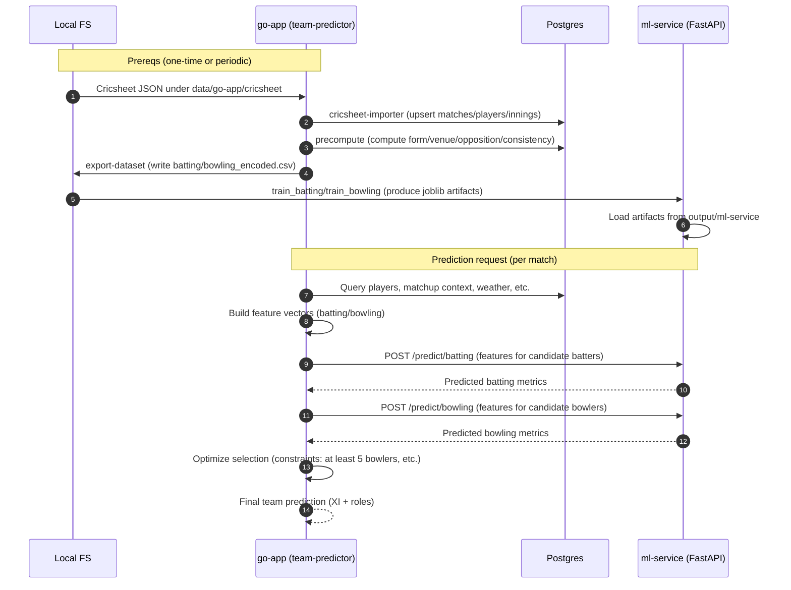

### System architecture overview

This document explains how the Go data pipeline and the Python ML service connect end‑to‑end, and in what order they run to produce the final team prediction.

#### Key components
- Data sources
  - Cricsheet JSON files under `data/go-app/cricsheet`
  - Optional curated CSVs under `data/go-app/createdb` (legacy/prototype import path)
- Go application (go-app)
  - `cmd/cricsheet-importer` — imports Cricsheet JSON into Postgres
  - `cmd/etl-importer` — imports curated CSVs into Postgres (optional path)
  - `cmd/precompute` — computes per-player features (form/venue/opposition/consistency)
  - `cmd/export-dataset` — exports model-ready CSVs to `output/go-app/`
  - `cmd/api` — HTTP API (optional orchestration)
  - `cmd/team-predictor` — CLI that assembles features for a match and calls the ML service to get predictions, then selects a team
- Postgres database — the system of record for ingested and computed data
- ML service (ml-service)
  - `ml/train_batting.py` / `ml/train_bowling.py` — train models from exported CSVs
  - `app/main.py` — FastAPI that loads artifacts and serves prediction endpoints
  - Artifacts (*.joblib) saved in `output/ml-service/`

#### Configuration and paths (summary)
- Precedence: CLI flags/args > environment variables > component `config.json` > built-in defaults
- Go app defaults in `go-app/config.json`; ML service defaults in `ml-service/config.json`
- Conventional directories:
  - Inputs under `data/{package}/...`
  - Outputs under `output/{package}/...`

See `docs/CONFIG.md` for full details.

---

### Data and control flow (end-to-end)

```mermaid
flowchart LR
  subgraph LocalFS[Local filesystem]
    CS[Cricsheet JSON\n data/go-app/cricsheet]
    CSV[Curated CSVs (optional)\n data/go-app/createdb]
    GOEXP[Exported CSVs\n output/go-app]
    ART[ML Artifacts\n output/ml-service]
  end

  subgraph GoApp[go-app]
    CI[cricsheet-importer]
    ETL[etl-importer]
    PRE[precompute]
    EXP[export-dataset]
    API[api (optional)]
    TP[team-predictor]
  end

  subgraph DB[(Postgres)]
  end

  subgraph ML[ml-service]
    TRAINB[train_batting.py]
    TRAINW[train_bowling.py]
    SVC[FastAPI app\n app/main.py]
  end

  CS --> CI --> DB
  CSV -. optional .-> ETL --> DB
  DB --> PRE --> DB
  DB --> EXP --> GOEXP
  GOEXP --> TRAINB --> ART
  GOEXP --> TRAINW --> ART
  ART --> SVC

  %% Runtime prediction path
  TP -- features from DB + context --> SVC
  SVC --> TP

  API -. optional orchestration .-> CI
  API -. optional orchestration .-> PRE
  API -. optional orchestration .-> EXP
```

Legend:
- Solid arrows are common/required paths.
- Dashed arrows are optional/alternate paths.

---

### Sequence: generating a team prediction (happy path)



Notes:
- The ML service returns non-zero predictions after artifacts exist in `output/ml-service`.
- `team-predictor` enforces constraints (e.g., minimum number of bowlers) when constructing the final team.

---

### How to run the full pipeline
- One-line bootstrap (recommended): `make up-all`
  - Brings up Postgres and services, runs migrations, imports data, precomputes features, exports datasets, trains ML artifacts, and restarts the ML service.
- Or step-by-step:
  1) `make migrate`
  2) `make cricsheet-import`
  3) `make precompute SEASON=2019`
  4) `make export-dataset`
  5) `make train-all`
  6) `make ml-serve` (if not using Docker)
  7) `make team-predictor MATCH=<match_id> BAT=6 BOWL=5`

See the root README for detailed usage and the per-component READMEs for flags and configuration.
