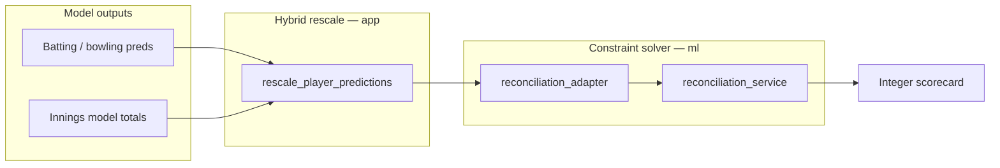

# Reconciliation layers in ml-service

Cricket match predictions come from several models (batting, bowling, fielding, innings, extras, win). Those outputs are not guaranteed to form a valid scorecard until they are **reconciled**. The service uses two complementary mechanisms.

## Overview

| Layer | Module | When used | Output |
|-------|--------|-----------|--------|
| **Hybrid rescale** | `app.reconciliation` | Share models off; innings model + `MatchContext` present | Continuous runs/wickets scaled to innings totals |
| **Constraint reconciliation** | `ml.reconciliation_adapter` → `ml.reconciliation_service` | Backtest/generate-match with innings targets | Integer per-player lines obeying team run/wicket constraints |

Both can apply in one backtest flow: hybrid rescale first (optional), then constraint reconciliation when innings totals are known.

## Hybrid rescale (`app/reconciliation`)

**Purpose:** Fast proportional adjustment so team aggregates match the innings model without solving a full optimization problem.

**Entry points:**

- `predict_innings()` — build innings feature vector, run innings regressor → `(inn1_runs, inn1_wkts, inn2_runs, inn2_wkts)`
- `rescale_player_predictions()` — scale each player’s runs/wickets so sums match those innings totals

**Used from:** `prediction_service._assemble_player_predictions` when `use_share` is false and `match_context` is set.

**Does not:** enforce integer scorecards, extras, or cross-innings win coherence. It is a **continuous** rescaling step.

## Constraint reconciliation (`ml/reconciliation_*`)

**Purpose:** Produce **integer** per-player statistics that stay close to model preferences while satisfying linear cricket constraints (team runs and wickets per innings).

**Pipeline:**

1. **`ml.reconciliation_adapter`** — maps `BacktestPlayerPred` + innings totals into `MatchReconciliationInputs` (Pydantic bundle in `app.models.reconciliation`).
2. **`ml.reconciliation_core.ProblemBuilder`** — builds variables and constraints for the QP.
3. **`ml.reconciliation_solver`** — solves the continuous problem.
4. **`ml.reconciliation_service.reconcile_match_players`** — rounds to integers and returns adjusted scorecards.

**Used from:** `prediction_service.apply_constraint_reconciliation_from_backtest_preds` after hybrid path (or instead of legacy rescale-only path).

**Config:** `ml.reconciliation` in `config.json` (e.g. `max_margin_fraction`, solver tolerances). See `ml.config.get_reconciliation_config`.

## Consistency checking

After constraint reconciliation, **`ml.consistency_checker`** can validate the reconciled scorecard (e.g. bowling runs conceded vs batting runs, wicket totals). Violations are logged from the adapter; they do not block the HTTP response.

## Feature alignment (innings / extras)

Match-level derived features (`ml.match_level_derived_features`) are shared by training (`ml.train_innings`, `ml.train_extras`) and inference (`app.reconciliation._innings_feature_dict`). Artifact sidecars (`innings_meta_*.json`) record `feature_names` and `derived_weights` so inference matches training.

See **docs/ml-and-training.md** (derived features and sidecar table).

## Choosing a path

| Scenario | Typical path |
|----------|----------------|
| `/predict/batting` only | No reconciliation |
| Backtest with `match_context`, share models | Innings totals from share model × innings prediction; optional constraint pass |
| Backtest with `match_context`, legacy models | Hybrid rescale → constraint reconciliation |
| `POST /api/ml/generate-match` | Full pipeline including win model; constraint reconciliation when innings known |

For API shapes, see **ml-service/README.md** (backtest and generate-match endpoints).
